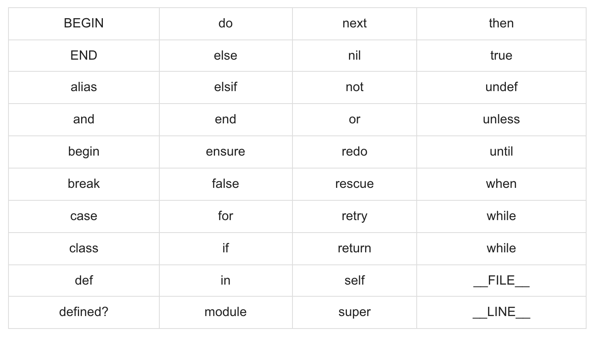

To print out something in Ruby, simply use `puts` method
We can also use `print` but it slightly difference. `puts` method add a new line but `print` not do that

```ruby
puts("Hello World!")
print("Hello World!")
print "Hello World!" # still valid
puts "Hello World!" # still valid
```

## Whitespace in Ruby

Whitespace characters in Ruby like spaces or tabs will be ignore, except when they appear in strings. But sometimes, however, they are used to interpret ambiguous statements. Interpretations of this sort produce warnings when the -w option is enabled.

```text
a + b is interpreted as a+b ( Here a is a local variable)
a  +b is interpreted as a(+b) ( Here a is a method call)
```

## Ending line in Ruby

Ruby interprets semicolons or newline charracters as the ending of a statement. If Ruby encounters some operators such as +,- or backslash at the end of line, they indicate the continuation of a statement

## Ruby identifiers

Identifiers are name of variables, constant and methods. Ruby indentifiers are case sensitive. It mean `test` and `TEST` are two difference identifiers.

Ruby identifier names may consist of alphanumeric characters and the underscore characters (\_)

## Reserved words

The following list contain all the reserved words in Ruby. These reserved words may not be used as a variable name. They are method names in Ruby


## Here Document in Ruby

`Here Document` refers to build string from multiple lines. Following a << you can specify a tring or an identifier to terminate string literal, and all line following current line up to the terminator are the value of the string

If the terminator is quoted, the type of quotes determines the type of the line-oriented string literal. Notice there is no space between << and terminator

```ruby
#!/usr/bin/ruby -w

print <<EOF
   This is the first way of creating
   here document ie. multiple line string.
EOF

print <<"EOF";                # same as above
   This is the second way of creating
   here document ie. multiple line string.
EOF

print <<`EOC`                 # execute commands
	echo hi there
	echo lo there
EOC

print <<"foo", <<"bar"  # you can stack them
	I said foo.
foo
	I said bar.
bar
```

Result:

```text
   This is the first way of creating
   her document ie. multiple line string.
   This is the second way of creating
   her document ie. multiple line string.
hi there
lo there
      I said foo.
      I said bar.
```

## Ruby BEGIN statement

### Syntax

```ruby
BEGIN {
   code
}
```

Declares code to be call before the program is run

### Example

```ruby
#!/usr/bin/ruby

puts "This is main Ruby Program"

BEGIN {
   puts "Initializing Ruby Program"
}
```

Result:

```text
Initializing Ruby Program
This is main Ruby Program
```

## Ruby END statement

### Example

```Ruby
END {
  code
}
```

Declares code to be call before the program is run

## Example

```ruby
#!/usr/bin/ruby

puts "This is main Ruby Program"

END {
   puts "Terminating Ruby Program"
}
BEGIN {
   puts "Initializing Ruby Program"
}
```

Result:

```text
Initializing Ruby Program
This is main Ruby Program
Terminating Ruby Program
```

## Ruby Comments

You can use hash character (#) at beginning of a line to start comment.

```ruby
# I am a comment. Just ignore me.
```

Multiple line comments must start with `=begin` and end with `=end`

```ruby
=begin
This is a comment.
This is a comment, too.
This is a comment, too.
I said that already.
=end
```
